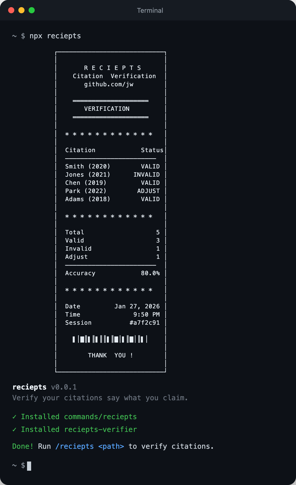
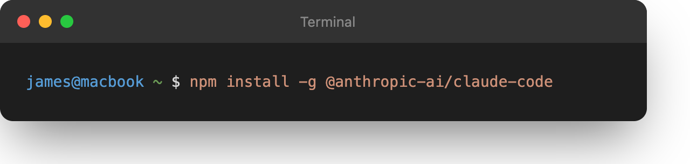
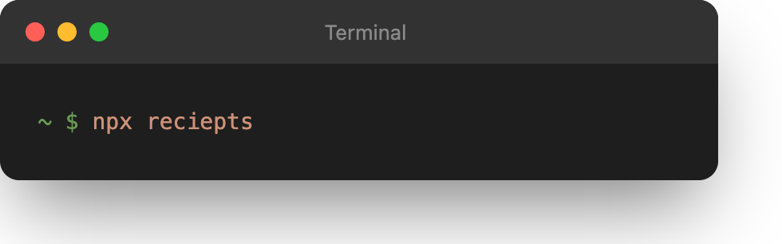
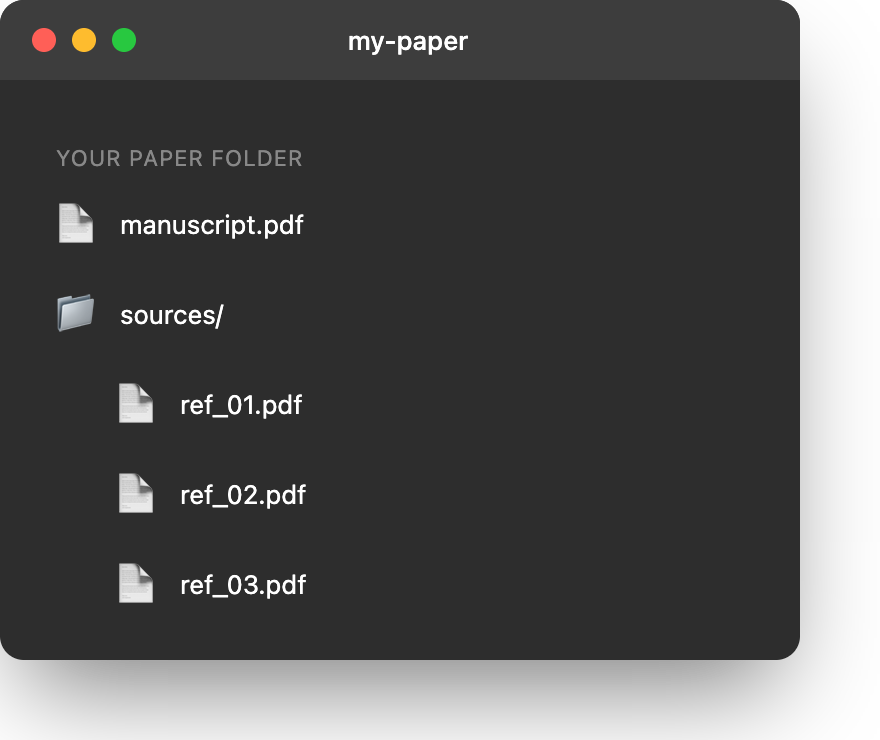
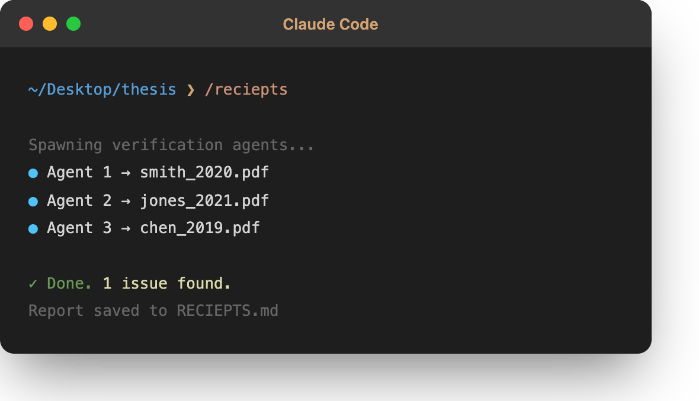

<h1 align="center">RECIEPTS</h1>

<p align="center">
<strong>GPTZero finds fake citations. reciepts finds real citations that don't say what you claim.</strong>
</p>

<p align="center">
<a href="https://www.npmjs.com/package/reciepts"></a>
<a href="https://github.com/JamesWeatherhead/reciepts/stargazers"></a>
<a href="https://opensource.org/licenses/MIT"></a>
</p>

<p align="center">

</p>

---

## Why I Built This

I review papers. I have seen citations that say the literal opposite of what the manuscript claims. Not fraud. Just human error. Memory is unreliable. Reading is hard. Deadlines are real.

LLMs made this worse. They confidently generate citation text that sounds right but is not. The paper exists. The author exists. The claim? Fabricated. [GPTZero found 100 hallucinated citations across 51 papers at NeurIPS 2024](https://techcrunch.com/2026/01/21/irony-alert-hallucinated-citations-found-in-papers-from-neurips-the-prestigious-ai-conference/). Those are the fake ones.

Nobody is counting the real papers that do not say what authors claim.

I built reciepts to fix that. One command. Parallel agents. Verbatim quotes. Done.

---

## Quick Start

### Step 1: Install Claude Code

Open Terminal. Copy and run this:

```bash
npm install -g @anthropic-ai/claude-code
```

<p align="center">

</p>

---

### Step 2: Install reciepts

Copy and run this:

```bash
npx reciepts
```

<p align="center">

</p>

You will see a receipt banner. That means it worked.

---

### Step 3: Set up your folder

<p align="center">

</p>

Create a folder like this:

```
thesis/
├── my_dissertation.pdf      ← your paper goes here
└── sources/                 ← create this folder
    ├── smith_2020.pdf       ← put your cited PDFs here
    ├── jones_2021.pdf
    └── chen_2019.pdf
```

---

### Step 4: Run reciepts

Open Claude Code in your paper folder. Type this:

```
/reciepts
```

<p align="center">

</p>

Done. Check `RECIEPTS.md` for your report.

---

## What You Get

```
# Citation Verification Report

| Status  | Count |
|---------|-------|
| VALID   | 47    |
| ADJUST  | 2     |
| INVALID | 1     |

## Issues Found

### [23] Smith et al. (2020)

**Your claim:** "achieved 99% accuracy on all benchmarks"
**Source says:** "achieves 73% accuracy on the standard benchmark"
**Fix:** Change "99%" to "73%", remove "all benchmarks"
```

| Status | Meaning |
|--------|---------|
| **VALID** | Citation is accurate |
| **ADJUST** | Small fix needed |
| **INVALID** | Source does not support claim |

---

## Cost

| Paper Size | Citations | Haiku 3.5 | Sonnet 4 | Opus 4.5 |
|------------|-----------|-----------|----------|----------|
| Short | 10 | ~$0.50 | ~$2 | ~$9 |
| Medium | 25 | ~$1.30 | ~$5 | ~$24 |
| Full | 50 | ~$3 | ~$11 | ~$56 |

Use Haiku for drafts. Opus for final submission. Your career is worth $56.

---

## Who This Is For

- PhD students submitting dissertations
- Researchers publishing papers
- Graduate students writing theses
- Anyone using AI writing assistants
- Reviewers who want to spot check

---

## FAQ

**Do I need an Anthropic API key?**
Yes. Claude Code requires one. [Get it here](https://console.anthropic.com/).

**What file formats work?**
PDF, Markdown, and Word docs.

**What if a source PDF is missing?**
reciepts will tell you which ones it could not find.

---

## License

MIT

---

<p align="center">
<strong>Your citations are only as good as your memory. reciepts is better than your memory.</strong>
</p>
