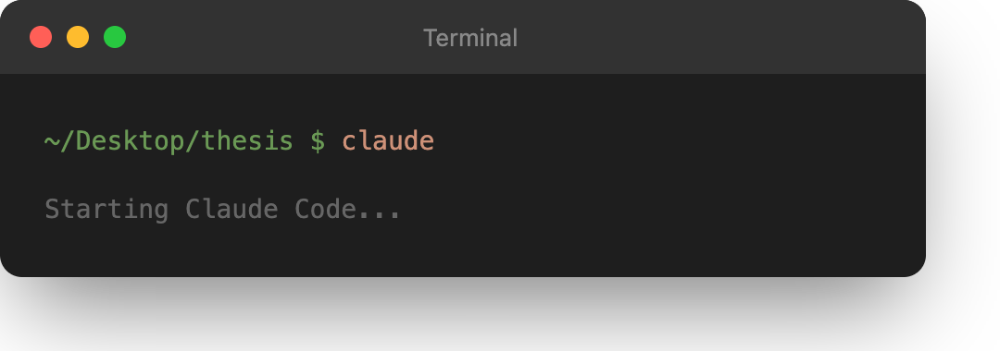

<h1 align="center">RECEIPTS</h1>

<p align="center">
<strong>GPTZero: "Is this citation real?"<br>receipts: "Is this citation <em>right</em>?"</strong>
</p>

<p align="center">
<a href="https://www.npmjs.com/package/receiptscc"></a>
<a href="https://github.com/JamesWeatherhead/receipts/stargazers"></a>
<a href="https://opensource.org/licenses/MIT"></a>
</p>

<p align="center">

</p>

<p align="center">
<em>Works on Mac, Windows, and Linux</em>
</p>

---

## The Problem

[GPTZero found 100 hallucinated citations across 51 papers at NeurIPS 2024.](https://techcrunch.com/2026/01/21/irony-alert-hallucinated-citations-found-in-papers-from-neurips-the-prestigious-ai-conference/) Those are the **fake** ones.

Nobody is counting the **real** papers that don't say what authors claim.

Your manuscript says: *"Smith et al. achieved 99% accuracy on all benchmarks"*

The actual paper says: *"We achieve 73% accuracy on the standard benchmark"*

Not fraud. Just human memory + exhaustion + LLM assistance = systematic misquotation.

**receipts catches this before your reviewers do.**

---

## What is this?

Give it your paper. Give it the PDFs you cited. It reads both. Tells you what's wrong.

Runs inside **[Claude Code](https://docs.anthropic.com/en/docs/claude-code)** (Anthropic's terminal assistant). One command. ~$0.50-$5 per paper.

Built by an MD/PhD student who got tired of manually re-checking citations at 2am before deadlines.

---

## Before You Start

You need two things:

### 1. Node.js

Check if you have it:

```bash
node --version
```

If you see a version number, you're good. If you see "command not found", download Node.js from **[nodejs.org](https://nodejs.org/)** and install it.

### 2. Anthropic API Key or Pro/Max Plan

You need one of these to use Claude Code:

- **API key:** Get one at **[console.anthropic.com](https://console.anthropic.com/)**. Requires a payment method.
- **Pro or Max plan:** If you subscribe to Claude Pro ($20/mo) or Max ($100/mo), you can use Claude Code without a separate API key.

---

## Setup (5 minutes)

### Step 1: Open your terminal

**Mac:** Press `Cmd + Space`, type `Terminal`, press Enter

**Windows:** Press `Win + X`, click "Terminal" or "PowerShell"

**Linux:** Press `Ctrl + Alt + T`

---

### Step 2: Install Claude Code

Copy this command and paste it into your terminal:

```bash
npm install -g @anthropic-ai/claude-code
```

<p align="center">

</p>

Wait for it to finish.

---

### Step 3: Install receiptscc

Copy and run this:

```bash
npx receiptscc
```

<p align="center">

</p>

You will see a receipt banner. That means it worked. You only do this once.

---

### Step 4: Set up your paper folder

Create a folder with your paper and sources:

<p align="center">

</p>

```
thesis/
├── my_paper.pdf          ← your paper (any name)
└── sources/              ← create this folder
    ├── smith_2020.pdf    ← PDFs you cited
    ├── jones_2021.pdf
    └── chen_2019.pdf
```

**Put your paper in the folder. Create a subfolder called `sources`. Put the PDFs you cited inside `sources`.**

---

### Step 5: Open Claude Code

Navigate to your paper folder and start Claude Code:

```bash
cd ~/Desktop/thesis
claude
```

<p align="center">

</p>

**Windows users:** Replace `~/Desktop/thesis` with your actual path, like `C:\Users\YourName\Desktop\thesis`

The first time you run `claude`, it will ask for your API key. Paste it in.

---

### Step 6: Run receipts

Now you are inside Claude Code. Type this command:

```
/receipts
```

<p align="center">

</p>

**Important:** The `/receipts` command only works inside Claude Code. If you type it in your regular terminal, it will not work.

receipts will read your paper, read your sources, and check every citation. When it finishes, it creates a file called `RECEIPTS.md` in your folder with the results.

---

## What You Get

A report showing which citations check out and which don't:

```
# Citation Verification Report

| Status  | Count |
|---------|-------|
| VALID   | 47    |
| ADJUST  | 2     |
| INVALID | 1     |

## Issues Found

### [23] Smith et al. (2020)

**Your claim:** "achieved 99% accuracy on all benchmarks"
**Source says:** "achieves 73% accuracy on the standard benchmark"
**Fix:** Change "99%" to "73%", remove "all benchmarks"
```

| Status | What it means |
|--------|---------------|
| **VALID** | Your citation is accurate |
| **ADJUST** | Small fix needed (wrong number, slightly off wording) |
| **INVALID** | Source does not support your claim |

---

## Cost

| Paper Size | Citations | Haiku 3.5 | Sonnet 4 | Opus 4.5 |
|------------|-----------|-----------|----------|----------|
| Short | 10 | ~$0.50 | ~$2 | ~$9 |
| Medium | 25 | ~$1.30 | ~$5 | ~$24 |
| Full | 50 | ~$3 | ~$11 | ~$56 |

Use Haiku for drafts. Opus for final submission.

---

## Lightweight Install

receipts adds only **29 tokens** to your Claude Code context:

| Component | What it is | Tokens |
|-----------|------------|--------|
| `/receipts` | The command definition | 13 |
| `receipts-verifier` | Agent template for verification | 16 |

That's the install footprint—two tiny files. The actual verification work uses Claude's normal token budget (hence the ~$0.50-$5 cost per paper).

---

## Troubleshooting

**"npm: command not found"**

You need Node.js. Download it from [nodejs.org](https://nodejs.org/).

**"bash: /receipts: No such file or directory"**

You typed `/receipts` in your regular terminal. You need to type it inside Claude Code. First run `claude` to start Claude Code, then type `/receipts`.

**"No manuscript found"**

Make sure your PDF is in the root folder, not inside a subfolder.

**"No sources directory"**

Create a folder called exactly `sources` (lowercase) and put your cited PDFs inside.

**Claude Code asks for an API key**

Either get an API key at [console.anthropic.com](https://console.anthropic.com/), or subscribe to Claude Pro/Max at [claude.ai](https://claude.ai/).

---

## License

MIT

---

<p align="center">
<strong>Your citations are only as good as your memory. receipts is better than your memory.</strong>
</p>
